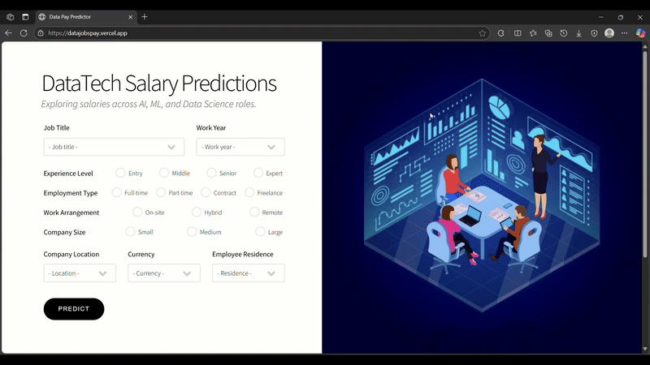

# DataJobsPay: Salary Predictor for Data Roles  

**DataJobsPay** is a fast, interactive salary prediction tool for data-related roles. Built with a Ridge Regression model and a clean web UI, it helps job seekers and analysts estimate salaries based on job title, experience level, location, and more.
🔗 Live Demo: https://datajobspay.vercel.app

  

## 🎯 Goal  
This project aims to make salary prediction for data jobs simple and insightful. Instead of manually analyzing trends, users can input a few job-related details and instantly see estimated salary. It’s great for career planning, HR research, or understanding market demand for data roles.

## 🚀 Quick Start

👉 Head to [DataJobsPay](https://datajobspay.vercel.app) and try predicting your data job salary!  
💡 After submitting the form, you'll receive a salary estimation instantly.
